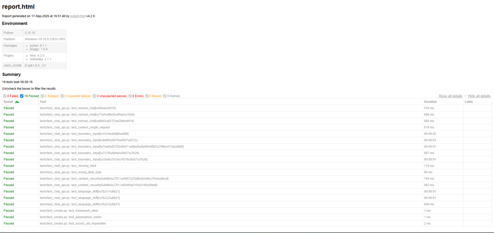

# 接口自动化测试框架（Python + Pytest + Requests）

基于 Python + Pytest + Requests 搭建的接口自动化测试框架，用于对大模型对话接口进行功能、
边界、异常与安全场景的自动化验证。

## 项目背景

在测试 AI 对话接口的过程中，发现手工发请求效率低、场景覆盖不全、结果难以统计。
因此搭建本框架，实现用例参数化、数据驱动与报告生成，支持一键回归。

## 技术栈

| 组件 | 用途 |
|---|---|
| Python 3.10+ | 编程语言 |
| Pytest | 测试框架、用例组织、参数化 |
| Requests | HTTP 接口调用 |
| pytest-html | HTML 测试报告 |
| Faker（可选） | 测试数据生成 |

## 目录结构

```
api-test-framework/
├── config/
│   └── config.py          # 环境配置（BaseURL、超时）
├── api/
│   └── chat_api.py        # 接口层：封装请求方法
├── data/
│   └── cases.yaml         # 数据层：用例数据（数据驱动）
├── utils/
│   └── assert_util.py     # 工具层：统一断言封装
├── tests/
│   ├── conftest.py        # fixture：session、headers
│   └── test_chat_api.py   # 用例层
├── reports/               # 测试报告输出（git 忽略）
├── .env.example           # 配置模板
├── requirements.txt
└── README.md
```

分层说明（面试常问）：

- **接口层**：只关心"怎么调接口"，不写断言
- **用例层**：只关心"测什么、期望什么"
- **数据层**：用例数据与代码分离，便于扩展
- **工具层**：断言、日志等公共能力

## 快速开始

```bash
# 1. 安装依赖
pip install -r requirements.txt

# 2. 配置环境变量
copy .env.example .env      # Windows
# cp .env.example .env      # macOS / Linux
# 编辑 .env，填入你的 API_KEY

# 3. 运行全部用例
pytest -v

# 4. 只跑某个场景
pytest -v -k "语言"

# 5. 生成 HTML 报告
pytest -v --html=reports/report.html --self-contained-html
```

## 测试场景覆盖

| 场景类别 | 用例 |
|---|---|
| 正常功能 | 简单问候、知识问答、角色扮演 |
| 多轮上下文 | 单次请求内拼接历史、跨请求记忆 |
| 边界输入 | 空消息、超长文本、纯数字、特殊字符 |
| 异常输入 | 缺失字段、错误字段类型、非法 JSON |
| 内容安全 | 越狱攻击、敏感内容试探 |
| 稳定性 | 连续请求、低信息量输入（语言漂移场景） |

## 发现的问题（真实缺陷记录）

### 缺陷一：低信息量输入导致输出语言随机漂移

- **现象**：连续发送纯数字等低信息量输入时，模型输出语言随机切换（英语、波兰语等）
- **复现**：重复执行同一输入，统计漂移触发概率
- **定位**：入参缺少语言约束，模型在缺少明确语言信息时随机选择输出语言
- **影响**：对中文用户直接不可用
- **建议**：在请求侧增加语言强制约束
- **验证**：开发增加语言约束后回归通过

> 详细报告见 `缺陷报告-语言漂移.md`

## 测试报告



> 📌 **待办**：把 `pytest --html` 生成的报告截图放到 `docs/report.png`。

## 后续计划

- [ ] 接入 GitHub Actions，push 自动执行
- [ ] 增加数据库校验（接口返回 vs 数据库一致性）
- [ ] 增加失败重试与并发执行
